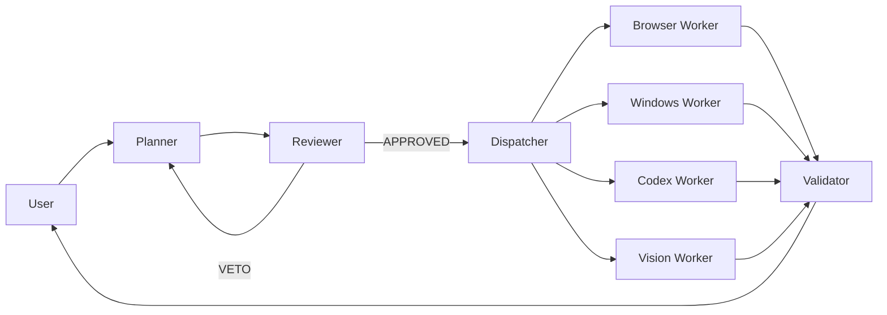

# Solo — Windows-First Personal AI Agent Orchestration

<p align="center">
  <em>English</em> | <a href="README.zh-CN.md">简体中文</a>
</p>

<p align="center">
  
  
  
  
</p>

<p align="center">
  <b>Open-source orchestration core for a Windows-first personal AI agent — with auditable task planning, approval gates, safe execution, and result verification.</b>
</p>

<p align="center">
  <a href="#project-status">Project Status</a> •
  <a href="#quick-start">Quick Start</a> •
  <a href="docs/ARCHITECTURE.md">Architecture</a> •
  <a href="docs/INSTALLATION.md">Installation</a> •
  <a href="ROADMAP.md">Roadmap</a>
</p>

---

## Project Status

> **Alpha** — This repository contains Solo's **public reference implementation and safe demo**.  
> Personal credentials, private integrations, production data, and deployment-specific configuration are intentionally excluded.

### Available in this repository

| Capability | Status | How to verify |
|-----------|--------|---------------|
| Task orchestration engine | ✅ Public | `tests/test_core.py` — 14 tests, 11+ pass |
| State machine (task lifecycle) | ✅ Public | `src/paios/paios/state_machine.py` |
| Approval model (create, review, approve) | ✅ Public | `src/orchestrator/openclaw_night_workflow/approvals.py` |
| Audit trail (evidence, file manifest) | ✅ Public | `src/orchestrator/openclaw_night_workflow/evidence.py` |
| Retry controller | ✅ Public | `src/orchestrator/openclaw_night_workflow/retry_controller.py` |
| Task store (SQLite persistence) | ✅ Public | `src/orchestrator/openclaw_night_workflow/task_store.py` |
| Agent team definitions (roles, permissions) | ✅ Public | `src/paios/paios/agent_team/` |
| Security utilities (secret refs) | ✅ Public | `src/paios/paios/security.py` |
| Risk assessment | ✅ Public | `src/paios/paios/risk.py` |
| Browser worker (CDP/Playwright) | 🟡 Beta | `workers/browser_worker/` |
| Computer Use worker (vision-based GUI) | 🟡 Experimental | `workers/computer_use/` |
| Windows UI automation worker | 🟡 Beta | `workers/windows_bridge/` |
| OCR/Vision worker | 🟡 Beta | `workers/vision_worker/` |
| Watchdog health monitoring | 🟡 Beta | `workers/watchdog/` |
| Safe demo (file-based task pipeline, no API keys) | ✅ Public | `.\scripts\start_demo.ps1` |

### Available in the private deployment only (not in this repository)

| Capability | Reason excluded |
|-----------|----------------|
| WeChat messaging gateway | Requires personal WeChat account credentials |
| OpenClaw Gateway configuration | Personal deployment-specific |
| Hermes Supervisor integration | Requires personal API keys |
| Docker infrastructure (PostgreSQL, NATS, Temporal, Grafana) | Requires service credentials |
| Full production 三省六部 agent roles | Contains permission bindings to personal accounts |
| Cloud vision models | Requires API keys |
| Computer Use with real mouse/keyboard | Risk of unintended system changes |
| Privacy broker | Contains personal data redaction patterns |
| STT (Faster-Whisper) | Requires model download; not tested on new machines |

## Quick Start

### Prerequisites

- Windows 10/11 (64-bit)
- Python 3.11+
- PowerShell 5.1+

### 1. Setup

```powershell
git clone https://github.com/chengcheng-2006/solo-windows-ai-agent.git
cd solo-windows-ai-agent
.\scripts\setup.ps1
```

### 2. Run the safe demo

```powershell
.\scripts\start_demo.ps1
```

This demonstrates the full orchestration pipeline:

```
Create task → Generate plan → Auto-review → Execute safe action → Validate → Write audit trail
```

All operations are **local, file-based, and require no API keys**.

### 3. Run the tests

```powershell
python tests/test_core.py
```

### 4. Review the audit output

```powershell
dir $env:TEMP\solo-demo-*\audit.json
```

### 5. Clean up

```powershell
.\scripts\stop_demo.ps1
```

## What Solo Does

Solo processes your task requests through a **multi-agent pipeline**:

```
User Request → Planner → Reviewer → Dispatcher → Workers → Validator → Result
```

Key design principles:
- **Separation of powers**: Planning, review, and execution are handled by different agents
- **Approval gates**: High-risk operations require human approval
- **Full audit trail**: Every step is logged and traceable
- **Self-hosted**: You bring your own API keys, data stays on your machine

## Architecture

See [docs/ARCHITECTURE.md](docs/ARCHITECTURE.md) for the full architecture.



## Security

- **No secrets in code**: Production credentials use DPAPI encryption, excluded from this repository
- **Approval gates**: All high-risk operations require explicit human approval
- **Audit trail**: Every action is logged with actor, timestamp, and result
- **Loopback-only**: Network services bind to localhost only

## Documentation

| Doc | Description |
|-----|-------------|
| [Architecture](docs/ARCHITECTURE.md) | System architecture and component overview |
| [Installation](docs/INSTALLATION.md) | Detailed installation guide |
| [Security Model](docs/SECURITY_MODEL.md) | How Solo keeps your system safe |
| [FAQ](docs/FAQ.md) | Frequently asked questions |
| [Development](docs/DEVELOPMENT.md) | How to contribute and extend |

## License

Solo/PAIOS core is licensed under **Apache 2.0**.  
Hermes Agent (Nous Research) is used under MIT license — see [THIRD_PARTY_NOTICES.md](THIRD_PARTY_NOTICES.md).

---

<p align="center">
  If this project helps you build a personal AI system on Windows, consider giving it a star ⭐
</p>
