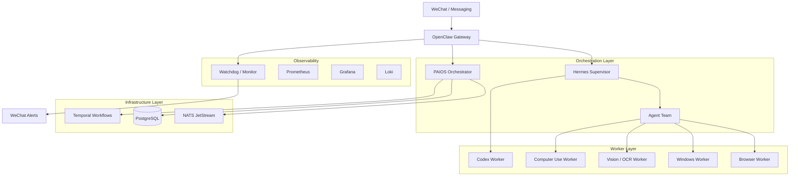
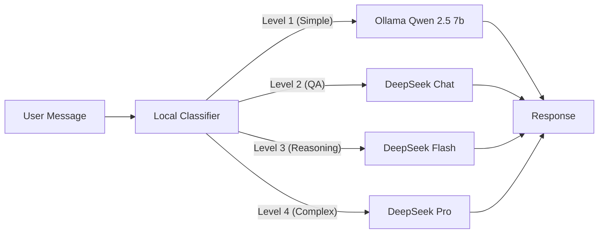
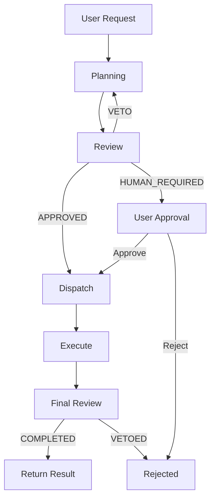

# Solo Architecture

> ⚠️ **Deprecation Notice (v0.1.1):** This document describes the v0.1.0 production architecture.
> The v0.1.1 release introduces a simplified `solo` package at `src/solo/` with Lite/Core/Full deployment modes.
> See `docs/internal/ADR_001_LIGHTWEIGHT_MODES.md` for the new architecture.
> The existing `src/orchestrator/` and `src/paios/` code is preserved but marked DEPRECATED.

## Overview (v0.1.0 Production)

Solo is a multi-layer personal AI system designed for Windows single-machine deployment. It combines message gateways, AI orchestration, browser/desktop automation, and approval-based safety controls.

## System Topology (v0.1.0)

## Component Breakdown

### 1. OpenClaw Gateway
- **Role**: Message gateway, identity management, approval, tool execution
- **Port**: 127.0.0.1:18789 (loopback only)
- **Channel**: WeChat (via openclaw-weixin plugin)
- **Security**: Token auth, owner-only, pairing DM policy

### 2. Hermes Supervisor
- **Role**: High-reasoning planning, supervision, retry, worker orchestration
- **Version**: v0.18.2
- **Backend**: DeepSeek V4 Pro (Anthropic-compatible API)
- **Agent Profiles**: codex-worker, research, general, code-review

### 3. PAIOS Orchestrator
- **Role**: Task store, event bus, routing, policy, audit
- **Components**:
  - `control_plane.py` — FastAPI server (port 8810)
  - `agent_team/` — Multi-agent orchestration (三省六部)
  - `privacy_broker.py` — Data redaction and privacy filtering
  - `database.py` — SQLite/PostgreSQL persistence
  - `risk.py` — Risk assessment engine

### 4. 三省六部 Agent Team (13 agents)

| Agent | Role | Model | Risk Ceiling |
|-------|------|-------|-------------|
| taizi | Front desk / classification | DeepSeek Flash | R1 |
| zhongshu | Planning | DeepSeek Pro | R1 |
| menxia | Review / approval | DeepSeek Pro | R2 |
| shangshu | Dispatch | DeepSeek Flash | R1 |
| libu | Agent registry | DeepSeek Chat | R1 |
| hubu | Resource management | DeepSeek Chat | R1 |
| rites | Messaging / STT | DeepSeek Chat | R0 |
| bingbu | Browser / UIA / OCR | DeepSeek Flash | R1 |
| xingbu | Audit / privacy | DeepSeek Pro | R2 |
| gongbu | Engineering / codex | DeepSeek Pro | R2 |
| vision | Vision / multimodal | GLM / OCR | R1 |
| speech | Voice input | DeepSeek Chat | R0 |
| zhipu-multimodal-free | Free vision agent | GLM 4.6V Flash | R1 |

### 5. Workers

| Worker | Language | Technology | Status |
|--------|----------|-----------|--------|
| Browser Worker | Python | CDP, Playwright | ✅ Stable |
| Computer Use | Python | Vision + Keyboard/Mouse | 🟡 Experimental |
| Vision Worker | Python | OCR (RapidOCR), GLM Vision | ✅ Stable |
| Windows Bridge | Python | UIA, NamedPipe | ✅ Stable |
| Watchdog | PowerShell | Health checks, alerts | ✅ Stable |
| Task Dispatcher | Python | NATS, Temporal | ✅ Stable |
| Executor Service | Python | Code execution | ✅ Stable |
| Event Publisher | Python | Event streaming | ✅ Stable |
| Codex Worker | - | Docker sandbox | ✅ Stable |

### 6. Infrastructure Services (Docker)

| Service | Image | Port | Purpose |
|---------|-------|------|---------|
| PostgreSQL | pgvector/pgvector:0.8.0-pg16 | 5432 | Task storage, vector embeddings |
| NATS | nats:2.14.0-alpine | 4222 | Event bus, messaging |
| Temporal | temporalio/auto-setup:1.29.7 | 7233 | Workflow orchestration |
| Prometheus | prom/prometheus:v3.5.0 | 9090 | Metrics collection |
| Grafana | grafana/grafana:12.0.2 | 3000 | Dashboards |
| Loki | grafana/loki:3.5.0 | 3100 | Log aggregation |
| Alloy | grafana/alloy:v1.16.1 | - | Log shipping |

### 7. Model Routing

Solo uses a 4-level model routing system:

### 8. Approval Flow

## Security Boundaries

- **Gateway**: Loopback-only binding, token auth, DM policy pairing
- **Tools**: Per-agent whitelist, 27 global deny rules
- **Exec**: Sandboxed (Docker) or native with approval
- **Secrets**: DPAPI-encrypted local store, no plaintext in config
- **Audit**: Full command logging, evidence directories, rollback support
